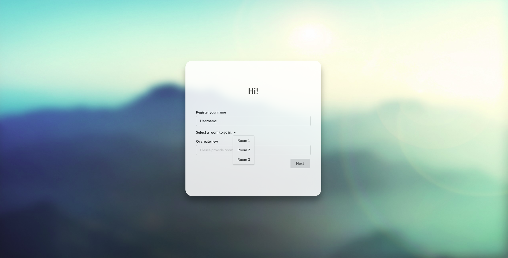
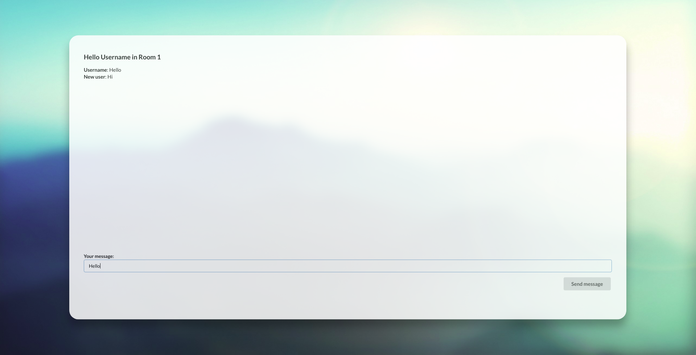

# chat2
The chat application in React and Django Channels with Django Rest Framework





## Setup guide

### Redis
```bash
sudo docker run -p 6379:6379 -d redis:2.8
```

### Backend

#### Environment
```bash
python3 -m venv env
source env/bin/activate
```

#### Django
```bash
pip install -r requirements.txt
python3 manage.py migrate
python3 manage.py runserver
```

In case of errors during installation proccess:
```bash
sudo apt-get install python3.6-dev
```

### Frontend
```bash
npm install
npm start
```

#### Finally
Open in browser
```bash
localhost:3000
```